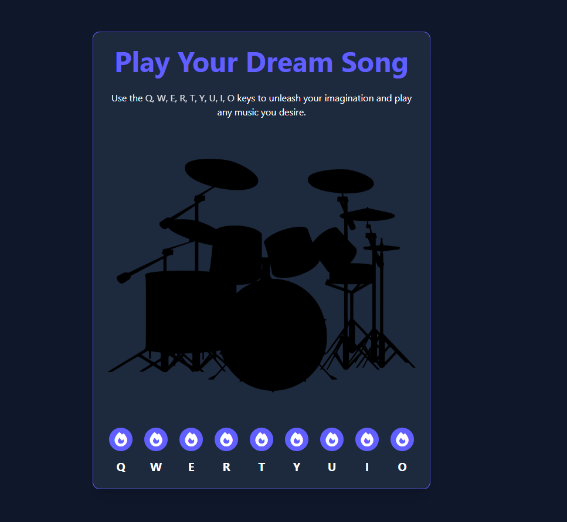

# Patika+ Frontend Bootcamp Hafta-05 / Ödev-02  (Drum Kit)

## Genel Bakış
Bu, HTML, CSS ve JavaScript kullanılarak oluşturulmuş basit bir davul kiti projesidir. Kullanıcılar, belirli tuşlara basarak farklı davul sesleri çalabilirler.

## Özellikler
- Klavye tuşları ile etkileşimli davul çalma.
- Tuşlara basıldığında akıcı animasyon efektleri.
- Farklı tuşlara atanmış çeşitli davul sesleri.
- Tailwind CSS kullanılarak oluşturulmuş modern ve duyarlı tasarım.

## Kullanılan Teknolojiler
- **HTML**: Projenin yapısal iskeleti.
- **CSS**: Stil ve animasyonlar.
- **JavaScript**: Kullanıcı etkileşimleri ve seslerin çalınması.
- **Tailwind CSS**: Stil ve düzenleme için.
- **Font Awesome**: İkonlar için.

## Tuş Atamaları
| Tuş | Ses |
|-----|-------|
| Q   | Tom |
| W   | Boom |
| E   | Clap |
| R   | HiHat |
| T   | Kick |
| Y   | OpenHat |
| U   | Ride |
| I   | Snare |
| O   | Tink |

### Canlı Site
[Drum Kit](https://emreykaya.github.io/w05-drum-kit/)

